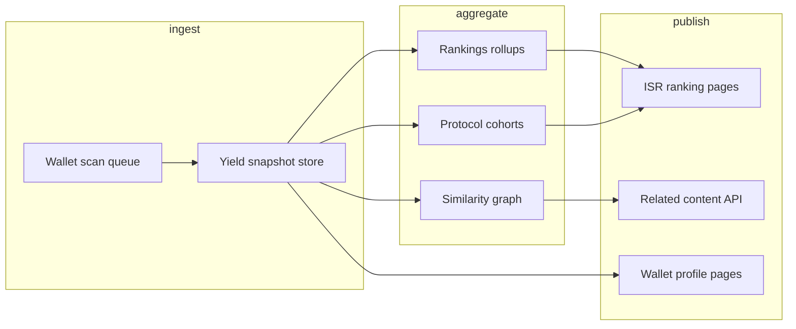

# SEO Architecture — Yield by DexKit

Public wallet pages, organic discovery, and the roadmap for programmatic SEO.

## Current implementation (Feature #3)

### Public wallet URLs

Every resolved wallet gets a permanent, shareable URL:

| Input | Canonical URL |
|-------|----------------|
| `vitalik.eth` | `https://yield.dexkit.com/vitalik.eth` |
| `0xd8dA6BF26964aF9D7eEd9e03E53415D37aA96045` | Redirects → `/vitalik.eth` when ENS exists |
| Raw address (no ENS) | `https://yield.dexkit.com/0x…` (lowercase) |

**Routing:** `src/app/[identifier]/page.tsx` — SSR via React Server Components.

**Canonical rules** (`src/lib/seo/wallet-url.ts`):

1. Prefer ENS name over hex address when reverse resolution succeeds.
2. Normalize address casing (lowercase) to avoid duplicate index entries.
3. `308` redirect via `redirect()` when the request slug is non-canonical.

### Rendering & caching

- **SSR:** Full page rendered on the server; no client-only data gate for crawlers.
- **ISR:** `revalidate = 300` (5 min) on wallet pages — balances freshness vs RPC cost.
- **Deduped fetches:** `getCachedWalletYield()` wraps `yieldService.calculateYield()` with React `cache()` so metadata, page body, and OG image share one computation per request.

### Metadata

| Field | Pattern |
|-------|---------|
| **Title** | `How Much Yield Does [Wallet] Generate?` |
| **Description** | `See estimated daily, monthly and annual yield for [Wallet].` + live figures |
| **Canonical** | `alternates.canonical` → preferred slug URL |
| **robots** | `index, follow` on valid wallets; `noindex` on 404 |

Code: `src/lib/seo/wallet-metadata.ts`, wired in `generateMetadata()`.

### Open Graph

- **Dynamic cards:** `/card/{wallet}.png` — see `docs/cards/ARCHITECTURE.md`
- Wallet metadata sets `og:image` to the card URL automatically (`theme=dark`)
- Size: 1200×630 PNG, edge-generated via `ImageResponse`

### Structured data (Schema.org)

Injected as JSON-LD on each wallet page (`src/components/seo/json-ld.tsx`):

| Type | Purpose |
|------|---------|
| `WebSite` | Site identity |
| `Organization` | DexKit publisher |
| `FinancialService` | Yield estimation product |
| `WebPage` | This wallet profile page |
| `Dataset` | Yield figures (daily / monthly / yearly, protocols, chains) |

Builder: `src/lib/seo/structured-data.ts`.

### Crawl infrastructure

| File | Role |
|------|------|
| `src/app/robots.ts` | Allow all agents; point to sitemap |
| `src/app/sitemap.ts` | Homepage seed only (wallet URLs discovered via links + future index) |

**Env:** `NEXT_PUBLIC_SITE_URL` (default `https://yield.dexkit.com`) drives canonical URLs, OG URLs, and sitemap.

---

## Related content (planned — not implemented)

Goal: increase time-on-site and internal linking without manual curation.

### Proposed modules

```
src/lib/seo/related/
  similar-wallets.ts      # Wallets with correlated protocol exposure
  similar-protocols.ts    # “Others earning on Morpho / Lido / …”
  yield-rankings.ts       # Percentile vs cohort
```

### Data sources (future)

| Signal | Use |
|--------|-----|
| Protocol overlap (Jaccard on position sets) | Similar wallets |
| Shared top-3 protocols | “Similar protocol exposure” |
| Monthly yield percentile | Rank badge on profile |
| Precomputed index table | Fast related lookups |

### UI placement (future)

- Below `YieldDetails` on wallet pages.
- Internal links only (`<a href="/other.eth">`) — no external thin content.

### Storage options

1. **On-demand** — compute on first view, cache in Redis/KV (simple, slow cold start).
2. **Batch index** — nightly job writes `wallet_relations` + `wallet_rankings` tables (recommended at scale).
3. **Hybrid** — batch for top 10k wallets; on-demand for long tail.

---

## Future SEO roadmap (architecture only)

Programmatic landing pages for high-intent queries. **Do not implement until index + ranking pipeline exists.**

### Page types

| Route pattern | Target query | Data source |
|---------------|--------------|-------------|
| `/rankings/top-yield-wallets` | “top defi yield wallets” | `wallet_rankings` by monthly USD |
| `/rankings/lido` | “top lido stakers” | Filter positions where `protocolId = lido` |
| `/rankings/etherfi` | “top ether.fi wallets” | Filter `protocolId = etherfi` |
| `/rankings/stablecoins` | “top stablecoin yield” | Sum USDC/USDT/DAI/sUSDS positions |
| `/reports/institutional/[slug]` | “[Fund] defi yield” | Curated allowlist + public addresses |
| `/reports/dao/[slug]` | “[DAO] treasury yield” | Treasury registry (DefiLlama / manual) |

### Index pipeline (proposed)



### Schema

```sql
-- Illustrative; not deployed
CREATE TABLE wallet_snapshots (
  address         text PRIMARY KEY,
  canonical_slug  text NOT NULL,
  ens_name        text,
  monthly_usd     numeric,
  yearly_usd      numeric,
  protocol_ids    text[],
  chain_ids       text[],
  calculated_at   timestamptz NOT NULL
);

CREATE INDEX ON wallet_snapshots (monthly_usd DESC);
CREATE INDEX ON wallet_snapshots USING GIN (protocol_ids);
```

### Rollout phases

| Phase | Scope |
|-------|--------|
| **A** | Snapshot store + top-100 monthly yield page |
| **B** | Per-protocol ranking pages (Lido, Ether.fi, Aave, …) |
| **C** | DAO / institutional report templates |
| **D** | Dynamic sitemap from `wallet_snapshots` (cap 50k URLs, `lastmod` from `calculated_at`) |
| **E** | Related content widgets on wallet pages |

### SEO guardrails

- **Noindex** wallets below a minimum position value (e.g. &lt; $10) to avoid thin pages.
- **Canonical** always via ENS when available.
- **Freshness** — show `calculatedAt` visibly; stale pages (&gt; 24h) deprioritized in sitemap `priority`.
- **Rate limits** — batch scans only; no crawler-triggered unbounded RPC.

---

## File map

```
src/lib/seo/
  site.ts              # SITE_URL, SITE_NAME
  wallet-url.ts        # Canonical slug + redirect logic
  wallet-metadata.ts   # Title, description, Metadata object
  structured-data.ts   # JSON-LD graph
  cached-yield.ts      # React cache wrapper

src/app/
  [identifier]/page.tsx
  [identifier]/opengraph-image.tsx
  robots.ts
  sitemap.ts

src/components/seo/
  json-ld.tsx
```

---

## Verification checklist

- [ ] `NEXT_PUBLIC_SITE_URL` set in production
- [ ] `/vitalik.eth` returns 200, canonical link, JSON-LD
- [ ] `/0xd8dA…` redirects to `/vitalik.eth`
- [ ] `/card/vitalik.eth.png` returns PNG (light + dark themes)
- [ ] Wallet page `og:image` points to `/card/{wallet}.png`
- [ ] Google Rich Results Test passes WebPage + Dataset
- [ ] `robots.txt` and `sitemap.xml` reachable
